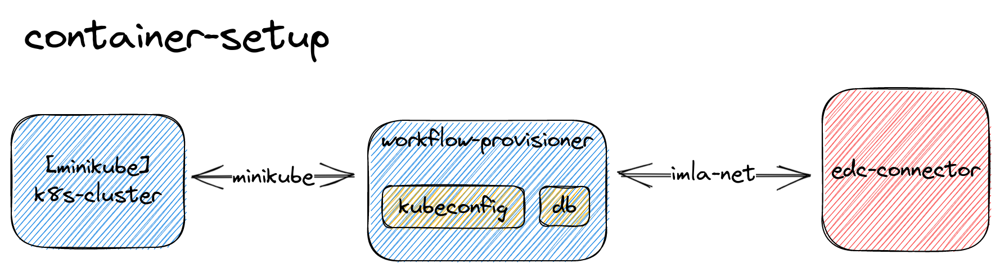

# Workflow Provisioner

This Repository contains the implementation of a HTTP-Provisioner for an EDC-Connector, which deploys a Workflow-Controller into a running K8s-Cluster.
After the deployment the access information can be retrieved.

## Prerequisite

- edc connectors with the required extensions and config ready
- running k8s
  - provisioner admin service-account

## Container Setup

At the moment scripts and the image is designend to run a separately in it's container.
The following shows a high level overiew of a local demo setup.



To run a local development setup of the workflow-provisioner container use the `test-run` target in the Makefile.
It creates a container and connects it to expected networks for the minikube cluster and the edc-connectors

```
make test-run
```

### Test Setup

After everything is running, the connectors can make their contract negotiation phase, which will in the end trigger provisioning process.