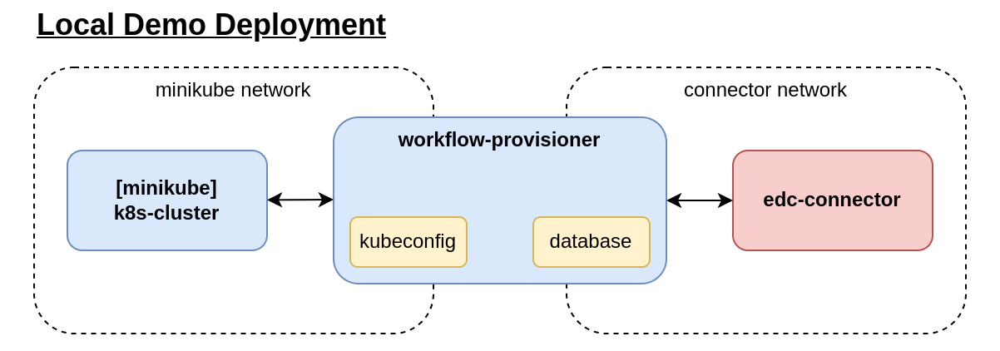

# Workflow Provisioner

This Repository contains the implementation of the Workflow-Provisioner which, in context of the [Eclipse Dataspace Componentes](https://github.com/eclipse-edc/Connector), realizes a HTTP-Provisioner for an EDC-Connector. This Component is  responsible in a provisioning request to deploy a [Workflow-Api](https://github.com/reisman234/workflow-api) into a running K8s-Cluster and registers Workflow-Assets wich are useable by Consumers. Furthermore stores it the access information for the consumer after a successful deployment. The access information itself can only be retrieved by the consumer over the edc connector.

## Prerequisite

- having edc connectors with the required extensions and config ready
  - provisioner extension
- running k8s
  - use the [local setup](./docs/setup.md) guide to prepare a local minikube.

## Container Setup

At the moment, scripts and the image is designend to run a separately in it's container.
The following shows a overview of a local demo setup.

After the cluster and connectors are prepared, run the workflow-provisioner container with `docker compose workflow-provisioner`
It creates a container and connects it to expected networks for the minikube cluster and the edc-connectors

After everything is running, the connectors can make their contract negotiation phase, which will in the end trigger provisioning process.
